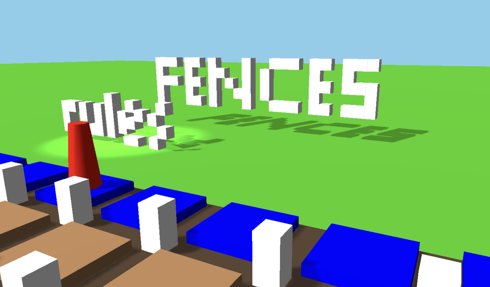
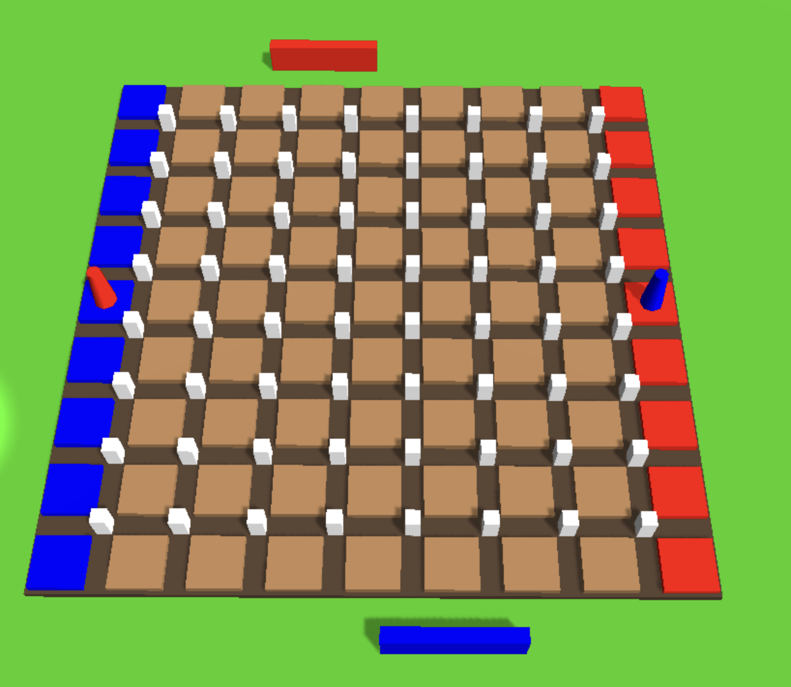
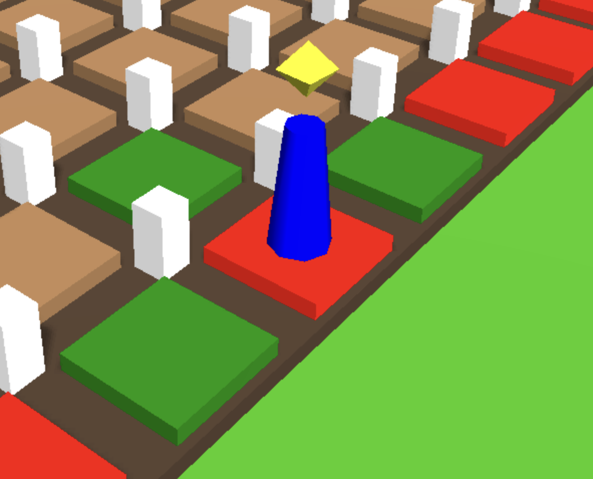

# FENCES

[FENCES](https://thatmoonman.github.io/FENCES/) is a minimalist-style board game I made using Javscript and the three.js library. In FENCES, you are tasked with moving your piece from one end of the board to the other before your opponent can do the same. I was inspired by the board game Quoridors™️ because of its simple design and easy to pickup play yet potential for deep strategy.



Your objective is to get your piece from one end of the board to any square on the opposite side. You and your opponent can place fences to block each other from achieving this task. To move, click on your piece, which will highlight the spaces you can click on to move to. If you want to place a fence, select the fence piece next to the board with the same color as your piece. Clicking on the fence post where you want to start the fence and the post in line will place the fence piece on the board. As you and your opponent play, you'll each get more fences to use based on the number of spaces you've moved around the board.

Click and drag or swipe to move the "camera" around the board. If you want to reset the view hit the spacebar.



## Wireframe


The three.js canvas takes up the entire window space and allows you to move your field of view around the "scene" of the game. The rules link and developer info link are Rendered in 3D so they appear when you hover over the "FENCES" or "rules" objects respectively.

## Functionality and MVPs

### In FENCES

* The user can select and unselect their piece (called Token in my code) or select a fence to play. Once they've selected their piece/fence, valid moves for that object are calculated and the applicable event handlers are added. Finalizing their turn cleans up handlers for a fresh start next turn. The select token function (featured below) grabs the piece and fence 3D objects from the threejs scene object as well as a special icon showing what they've selected, allowing the game logic to connect to what is happening in the rendered 3D space.

```js
selectToken() {
        //capture Game context
        let that = this;

        //scene Object containing rendered objects
        const scene = this.board.scene;
        const renderer = this.board.renderer
        const camera = this.board.camera

        //var constructor from scene
        let playerToken;
        let playerFence;
        let tokenSelector;
        for (let i = 0; i < scene.children.length; i++) {
            if (scene.children[i].name === "humanToken") {playerToken = scene.children[i]}
            if (scene.children[i].name === "tokenSelector") {tokenSelector = scene.children[i]}
            if (scene.children[i].name === "playerFence") {playerFence = scene.children[i]}
        }
        this.board.interactionManager.add(playerToken)
        
        //Select and unselect cycle for player's token
        playerToken.addEventListener("click", function selectPlayerToken(event) {
            event.stopPropagation();
            
            //set highlighted functionality
            tokenSelector.visible = true;
            let targetPos = event.target.position
            tokenSelector.position.set(targetPos["x"], 6, targetPos["z"]);
            
            // playerToken.removeEventListener("click", selectPlayerToken);
            return that.placeToken(playerToken, tokenSelector, playerFence), 
            {once: true}
        })        
    }
```



* Once the player goes, it's the computer player's turn to think. The computer player builds a move tree for itself and its opponent and uses a breadth first search to find the shortest paths for both. I then will randomly choose whether it wants to move or place a fence somewhere along the player's path. The computer player will keep track of the way the player is playing (moving vs fencing) and will change its strategy based on how the player is moving by weighting each action in response to the player's actions. The functionality for the computer determining where to move and where the player can move utilize the same valid moves function (featured below).

```js
validMoves(startPos) {
        const fenceCheck = [[1, 0], [-1, 0], [0, 1], [0, -1]]
        const moves = [[2, 0], [-2, 0], [0, 2], [0, -2]]
 
        let fenceCheckMoves = fenceCheck.map( pos => {
            return [pos[0] + startPos[0], pos[1] + startPos[1]]
        })
        
        let possibleValidMoves = moves.map( pos => {
            return [pos[0] + startPos[0], pos[1] + startPos[1]]
        })

        let newValidMoves = []

        for (let i = 0; i < 4; i++) {
            let onboard = true
            let nofence = true
            let unvisitted = true

            let pos = possibleValidMoves[i]
            let fence = fenceCheckMoves[i]

            if (pos[0] < 0 || pos[1] < 0 || pos[0] > 16 || pos[1] > 16) {
                onboard = false     //move is off the board  
            } else if (fence[0] >= 0 && fence[1] >= 0 && fence[0] <= 16 && fence[1] <= 16 && !this._at(fence)) {
                nofence = false //fence in the way
            } else if (this._alreadyConsidered(pos)) {
                unvisitted = false //already visitted
            }
 
            if (onboard && nofence && unvisitted) {
                newValidMoves.push(pos)
            }
        }

        return newValidMoves
    }
```

* Once the a player meets the game over conditions, a spotlight will show on the winning piece and the losing piece will be "knocked over". The screen will display a message prompting the player if they would like to play again and then reset the scene with a new game.

## technologies libraries apis

* The [three.js library](https://threejs.org/) for rendering a 3D scene with 3D interactable objects.
* [THREE.interactive](https://github.com/markuslerner/THREE.Interactive) for handling mouse events in three.js
* Webpack to bundle and transpile the source JavaScript code.
* npm to manage project dependencies.

## timeline

* Friday: Setup webpack and organize project files and folders. Integrate three.js library so there is a visual "space/landscape"
* Saturday/Sunday: Create Board, Player, and Piece classes with Fence/Token subclasses of Piece. Board renders with threeJS. Game logic mostly complete.
* Monday: Continue to tighten game logic. Render pieces to board. Board should be responsive.
* Tueday: Fully responsive game and fix bugs.
* Wednesday: Implement links and rules. Endgame functionality. Work on styling and bug squashing.
* Thursday: Deploy to github pages.

## future

* Add a 3D counter so the player knows how many fences they have left
* Allow the player to choose their color
* Add difficulty levels for Computer player logic
* Add multiplayer functionality
* Add music and sound effects

