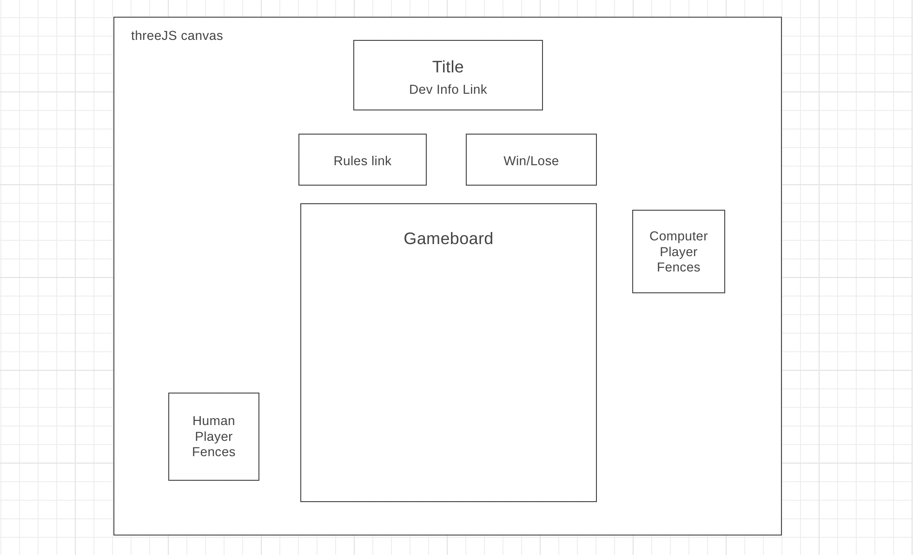

# FENCES

<a href="https://thatmoonman.github.io/FENCES/" target="_blank">FENCES</a> is a board game 

=> about game and me

=> wireframe

=> functionality and mvp

=> technologies libraries apis

=> timeline

=> future

=>licensing?

////////////////////////////////////////////////////////////////////////////////////////////////////////////////////////////////
**JS Project Final Proposal:**
**FENCES (a take on the game Quoridors)**

**Background**

FENCES is a game that will build upon the minimalist boardgame Quaridors. In this game, you will play as a single Token with a simple objective; get your Token to the other end of the board before your opponent gets their Token to your side. Each turn, you will have to decide wether to move your Token or place a Fence. The simplicity of rules means that the game is easy to play yet as complex in strategy as you can make it.

For my version of the game you will play against a computer player whose strategy will be dynamic based upon how you play. Whereas in Quoridors you start with a set number finite Fences, my version will have you start with less but gain more depending on the number of spaces your opponent's Token has travelled. This will encourage the player to form deeper strategies for baiting the opponent into dead ends and forcing them to take longer routes while also taking into consideration the shortest path to victory themselves. 

**Functionality & MVP**

In "FENCES", users will be able to:

-Start and Restart the game board
-Move their piece to a selected valid space
-Place a fence in a valid position
-Choose the color of their Token and Fence
-Rotate camera around the board

In addition, this project will include:

-An instructions button, showing the user how to play
-A production README

**Wireframe**

/Users/justinkilburn/Desktop/Fences/Wireframe.png

*? indicates reach goal implementations*

-Controls:
--new game button to restart which prompts color choice for player Token/fences
--tutorial button
--camera angle toggle?
--sfx on/off?
--music on/off?

-Nav Links: links to my github, linkedin

-Title: A large stylized "FENCES" (interactive?)
-Game Board: Rotatable interactive '3d' game board
--the player will interact with the board by clicking their piece and then valid square they want to move that piece to or by clicking one of their fences and the place on the board they wish to place said fence (if valid)
-Player/Computer unplayed fences: A visual "stable" of remaining fences, (2d or 3d?)
-Moves until next fence: an indicator of the number of moves needed before the player or computer will recieve their next fence, (2d or 3d?)

?As a reach goal for myself, I would like to implement all the parts of this wireframe into the '3d landscape', giving the whole page a feeling of looking down onto the game and its controls/links

**Technologies/Libraries**

This project will make use of the following:
-The three.js library for '3d' rendering of the board and pieces
-possible the Canvas API for '2d' features
-Webpack and Babel to bundle and transpile source Javascript
-npm for managing dependencies

**Implementation Time**

-Friday: Webpack up and running. Integrate three.js library so there is a visual "space/landscape"

-Saturday/Sunday: Create Board, Player, and Piece classes with Fence/Token subclasses of Piece. Board renders with threeJS. Game logic complete.

-Monday: Finalize game logic. Render pieces to board. Board should be responsive.

*Stop-gap: Make decision on reach goals: how aspects of the board will be rendered(3d vs 2d), title, sfx/music, camera angle toggle

-Tueday: Implement controls links and nav links, continue work on 3d rendering, implement endgame, test for bugs

-Wednesday: Finalize/polish, more testing, reach goals?

-Thursday: Deploy to github pages, POLISH!, create Readme.

**Bonus Features**
Some of me reach goals fall in line with bonuses:
-music
-sound effects
-full 3-d rendering of the entire page

Other bonus features that could be added in the future:
-skins for the board and fences to change settings (ex: garden with grassy board and "hedges", castle with cobblestone board and "stone walls", etc)
-levels of difficulty for the Computer Player
-Drag and drop the pieces themselves into position

